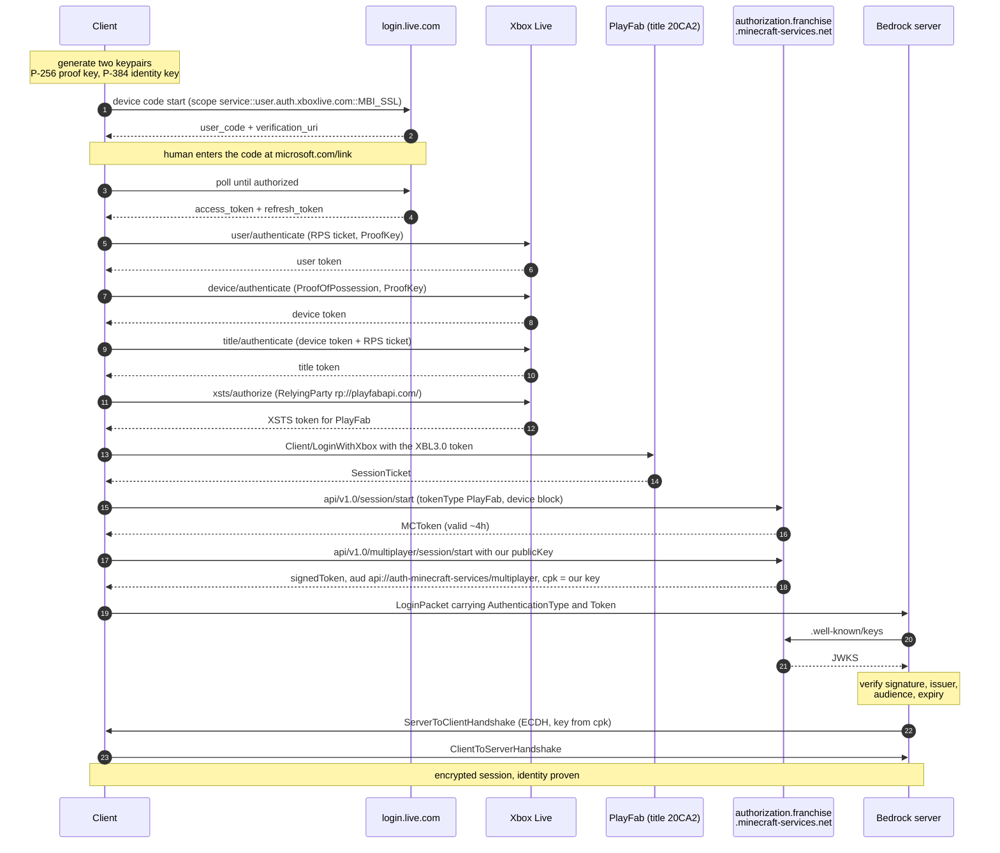
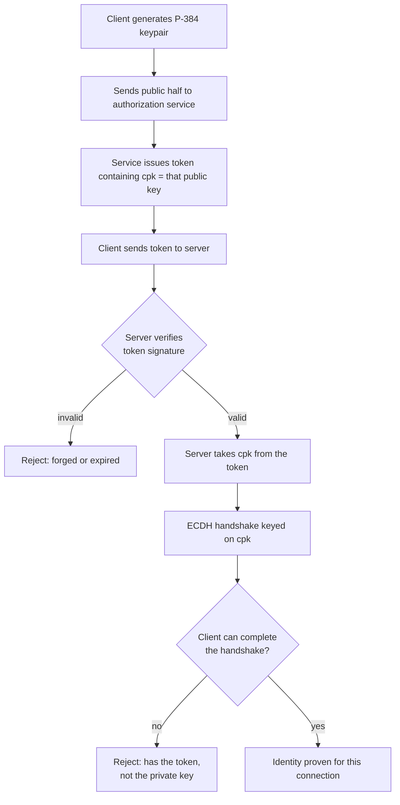

# Bedrock authentication: Xbox Live, PlayFab and the franchise authorization service

How a Minecraft: Bedrock Edition client proves who it is, how that changed between 2016 and now,
and what a server has to check. Written against protocol 2168 (game 1.26.40) and verified against
the live services in August 2026.

## Why any of this exists

A Bedrock server has to answer one question before a player spawns: is this person who they say
they are. The answer matters because the display name and XUID a client sends are what everything
else keys off, permissions, bans, player lists, and a name is trivially typed into JSON by anyone.

Bedrock solves it by never trusting the client's claim directly. The client presents a token signed
by Mojang, and the server checks that signature. What has changed over the years is which service
issues that token, what shape it takes, and how the client gets one.

There is a second half that is easy to miss and is the part most home-grown implementations get
wrong. A signed token proves the identity exists. It does not prove the connection in front of you
owns it, because a token is just bytes and can be replayed by anyone who captured one. Bedrock
closes that with a public key claim: the token names a key, and the connection must prove it holds
the private half. That mechanism, `cpk`, runs through everything below.

## The three eras

### Era 1: the certificate chain

The original scheme. The client authenticates to Xbox Live, then posts its own generated public key
to `https://multiplayer.minecraft.net/authentication`, and Mojang returns a JSON certificate chain:
a short list of JWTs where each link carries the public key that verifies the next.

The last link carries the player's identity in `extraData`:

```json
{
  "extraData": {
    "identity": "…uuid…",
    "displayName": "gurunx",
    "XUID": "…",
    "titleId": "…",
    "sandboxId": "RETAIL"
  },
  "identityPublicKey": "…"
}
```

The server walks the chain from Mojang's known root, then uses the final `identityPublicKey` for the
encryption handshake, which is what ties the identity to the connection.

This endpoint still works today. It was verified in August 2026 and returns a two link chain. It is
simply no longer the thing a modern client logs in with.

### Era 2: the transition, 1.21.90 onwards

Mojang began moving identity out of the chain and into a single token issued by a new service. The
login packet's identity field became an envelope rather than a bare chain:

```json
{
  "AuthenticationType": 0,
  "Token": "…JWT…",
  "Certificate": "…legacy chain, still sent…"
}
```

For a while clients sent both, so servers could read either. MiNET handles exactly this at
[LoginMessageHandler.cs:308-324](../src/MiNET/MiNET/LoginMessageHandler.cs#L308-L324).

`AuthenticationType` distinguishes a real account from an offline one. Type 0 is full authentication
and omits the chain entirely; type 2 is offline and carries an empty chain with a self signed token.

### Era 3: 1.26.30 onwards, the token is all there is

The certificate chain payload is no longer sent to servers. Identity is the token, and servers are
expected to validate it against the issuer's published keys rather than against a hardcoded Mojang
root.

The token is issued by the franchise authorization service and looks like this:

| claim | meaning |
| --- | --- |
| `iss` | `https://authorization.franchise.minecraft-services.net/` |
| `aud` | `api://auth-minecraft-services/multiplayer` |
| `cpk` | client public key, the proof of possession binding |
| `xid` | XUID |
| `xname` | display name |
| `mid` | Minecraft id |
| `tid` | PlayFab title id |
| `ipt` | platform type, `PlayFab` |
| `pfcd` | PlayFab account creation date |
| `ap` | account permissions |
| `sub`, `iat`, `exp` | standard JWT claims |

MiNET validates this in [FranchiseTokenValidator.cs](../src/MiNET/MiNET/Utils/Cryptography/FranchiseTokenValidator.cs),
fetching signing keys from `https://authorization.franchise.minecraft-services.net/.well-known/keys`
and checking issuer, audience and expiry.

## The cast

| party | role |
| --- | --- |
| Microsoft account (MSA) | the human's actual login, `login.live.com` |
| Xbox Live | turns an MSA login into Xbox tokens, and binds a device |
| PlayFab | Microsoft's game backend. Minecraft is title `20CA2` |
| Franchise authorization service | issues the modern login token |
| Mojang chain service | issues the legacy certificate chain, still live |
| Discovery service | tells the client where all of the above are |

Discovery is the piece that makes the rest maintainable. It is public, needs no authentication, and
is keyed by game build:

```
GET https://client.discovery.minecraft-services.net/api/v1.0/discovery/MinecraftPE/builds/1.26.40
```

It returns service URIs for auth, signaling, multiplayer, realms and more, plus the PlayFab title id
and, for signaling, the STUN and TURN servers. Anything that hardcodes these URLs breaks on a
version bump; anything that reads them from discovery follows along.

## The full flow

Every hop below has been run against the live services. The dashed returns are what each step
actually yields.



### Why the request signing exists

The three Xbox hops are not plain HTTP. Each carries a `Signature` header, an ECDSA signature over
a buffer containing a version prefix, a Windows FILETIME timestamp, the method, the path, the
`Authorization` header and the body. It is signed with the P-256 proof key, whose public half is
sent in the same request as `ProofKey`.

This is what makes the device identity meaningful. Xbox records which proof key registered a device
id, and refuses that id with any other key, which is worth knowing because it produces a bare 403
with an empty body and a zeroed `X-XblCorrelationId`, and no explanation at all.

## What proves possession

The `cpk` claim is the hinge, and it is why a captured token is not a usable credential.



A stolen token gets to step G and dies at step I. The holder can present the identity but cannot
complete a handshake keyed to a private key they do not have. This is also why MiNET's validator
carries the warning that verifying the token is not by itself enough: the caller must compare `cpk`
against the key the encryption handshake actually used.

## How NetherNet reuses the same token

NetherNet, the WebRTC transport that replaced RakNet as the BDS default in 1.26.50, does not invent
a new identity system. It carries the same token inside the SDP offer as a session level
`a=identity` attribute, base64 encoded:

```json
{
  "idp": { "domain": "<issuer domain>", "protocol": "default" },
  "assertion": "{ \"token\": \"<the token above>\", \"fingerprints\": \"<detached JWS>\" }"
}
```

The `fingerprints` field is a detached JWS over the SDP's `a=fingerprint` lines, signed with the
private key matching `cpk`. Same proof of possession idea, applied to the DTLS certificate instead
of an ECDH handshake: the token says who you are, the signature says these DTLS fingerprints are
yours, and WebRTC guarantees the DTLS certificate matches those fingerprints.

Because the fingerprints are generated fresh per connection, a captured assertion cannot be replayed
onto a different connection. This is the same reason a captured login token cannot be reused.

A server that receives an offer with no `a=identity` may reject or allow, and that is explicitly a
policy decision. BDS rejects, with `DisconnectFailReason` 37, `MultiplayerDisabled`, returned as a
bare `37` in the HTTP response body before the SDP is even parsed.

## Endpoint reference

| purpose | endpoint |
| --- | --- |
| Service discovery | `https://client.discovery.minecraft-services.net/api/v1.0/discovery/MinecraftPE/builds/{version}` |
| MSA device code start | `https://login.live.com/oauth20_connect.srf` |
| MSA token and refresh | `https://login.live.com/oauth20_token.srf` |
| Xbox user token | `https://user.auth.xboxlive.com/user/authenticate` |
| Xbox device token | `https://device.auth.xboxlive.com/device/authenticate` |
| Xbox title token | `https://title.auth.xboxlive.com/title/authenticate` |
| XSTS | `https://xsts.auth.xboxlive.com/xsts/authorize` |
| PlayFab login | `https://{titleId}.playfabapi.com/Client/LoginWithXbox` |
| MCToken | `POST {authUri}/api/v1.0/session/start` |
| Login token | `POST {authUri}/api/v1.0/multiplayer/session/start` |
| Server side JWKS | `{authUri}/.well-known/keys` |
| OIDC metadata | `{authUri}/.well-known/openid-configuration` |
| Legacy chain | `https://multiplayer.minecraft.net/authentication` |

MSA client id is `00000000441cc96b`. XSTS tokens are encrypted per relying party, so a token minted
for `https://multiplayer.minecraft.net/` cannot be used against PlayFab, which surfaces as
`401 Unable to decrypt token body` rather than anything mentioning relying parties.

## What MiNET does today

Both directions are implemented.

**Validating a token**, which is what a server does.
[FranchiseTokenValidator](../src/MiNET/MiNET/Utils/Cryptography/FranchiseTokenValidator.cs) verifies
the signature against the issuer's JWKS, with key rotation and a rate limited refetch so a client
sending nonsense key ids cannot turn logins into a request flood, then checks issuer, audience and
expiry. [LoginMessageHandler](../src/MiNET/MiNET/LoginMessageHandler.cs) reads both the modern
envelope and the legacy chain.

**Acquiring a token**, which is what a client does.
[XboxAuthentication](../src/MiNET/MiNET/Utils/Cryptography/XboxAuthentication.cs) walks the whole
flow in the diagram above and returns an `XboxIdentity`: the login token, the keypair it names, and
the display name and XUID. Service endpoints come from discovery keyed by the game version rather
than constants. It refuses a token whose `cpk` does not match the key it sent, because such a token
cannot complete a handshake and failing early beats failing at the server.

Session state lives behind [IXboxSessionStore](../src/MiNET/MiNET/Utils/Cryptography/XboxSessionStore.cs).
The bundled implementation writes to `%LOCALAPPDATA%/MiNET`, encrypted with DPAPI at CurrentUser
scope on Windows. DPAPI has no cross-platform equivalent, so elsewhere the file is written with
owner-only permissions and a warning rather than a pretence; supply your own store to do better.

The client opts in with `MINET_XBL=1`, which prints a device code on first use and refreshes
silently after that. With an identity set,
[MiNetClient.SendLogin](../src/MiNET/MiNET.Client/MiNetClient.cs) sends `AuthenticationType: 0` with
no certificate chain and signs the client data with the key named in `cpk`.

For offline play, [CryptoUtils.EncodeOfflineMultiplayerToken](../src/MiNET/MiNET/Utils/Cryptography/CryptoUtils.cs)
mints a self signed token in the same shape, with `iss: self` and an empty `xid`, using the same
audience so the structure matches what a server expects.

### Verified

MiNET.Client authenticating as a real Xbox Live account and reaching spawn on BDS 1.26.40 with
`online-mode=true`, protocol 2168, August 2026. The same identity is what NetherNet's `a=identity`
assertion needs, which is the remaining piece for that transport.

### Things that cost time, worth knowing

An XSTS token is encrypted for one relying party. Reusing one issued for
`https://multiplayer.minecraft.net/` against PlayFab fails with `401 Unable to decrypt token body`,
which mentions neither relying parties nor which token was wrong.

Xbox binds a device id to the proof key that registered it, and refuses that id with any other key.
The refusal is a bare `403` with an empty body and a zeroed `X-XblCorrelationId`, so the device id
and its key have to be treated as one credential and replaced together.

The MSA refresh grant needs the `scope` parameter. Without it the refresh is rejected and every run
asks for a device code.

## Credit

The authorization service endpoints are documented in
[Kaooot/bedrock-protocol-docs](https://github.com/Kaooot/bedrock-protocol-docs/blob/master/additional_docs/AuthorizationServiceDocs.md).
The Xbox Live chain, including the request signing format, follows
[ConcreteMC/Alex](https://github.com/ConcreteMC/Alex), which is MPL-2.0.
