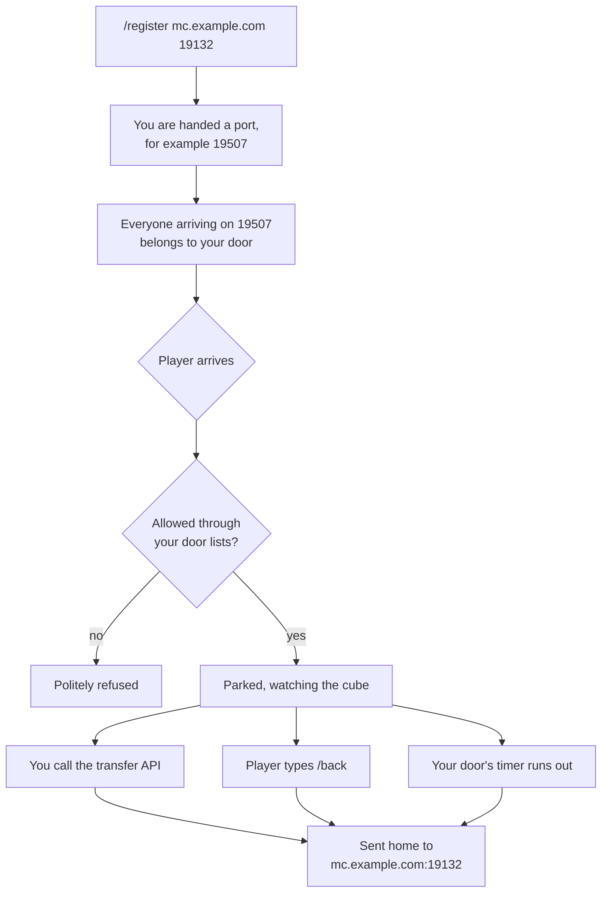
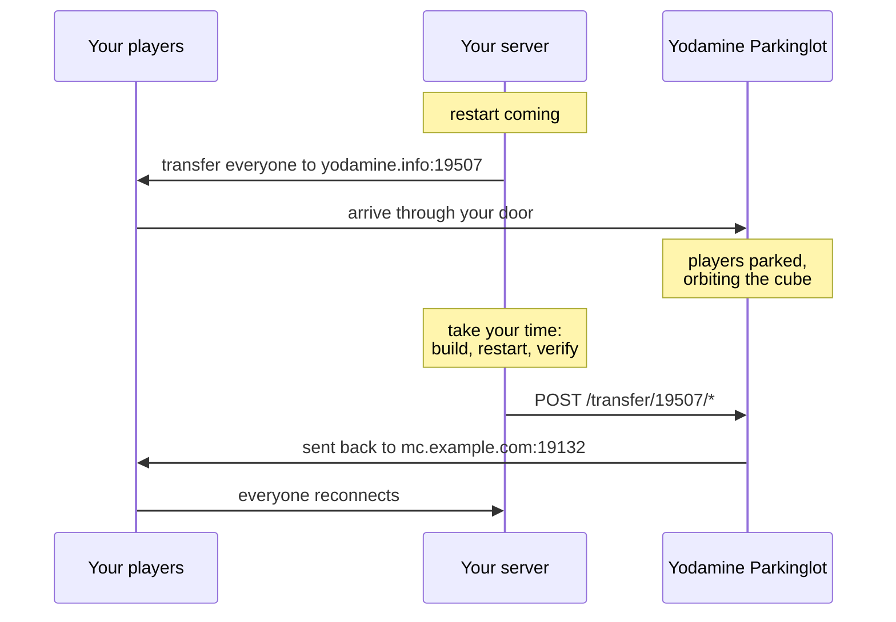

# Yodamine Parkinglot

A parking lot for Minecraft Bedrock players. When your server needs to go down for a restart, send your players here; the parking lot keeps them connected and brings them back to you when you are up again.

The public instance runs at **`yodamine.info:19132`**.

## Why it exists

A transferred Bedrock client retries its destination for about 22 seconds and then gives up with a connection error. That is all the time a restart gets before it starts losing players. Parked players wait as long as they need to, and come back on command, by themselves, or on a timer.

While parked, a player floats as a spectator inside the MiNET mark, a giant hollow cube in an empty void, with the camera slowly circling it. No inventory, no movement, nothing to break. Just a waiting room with a view.

## Nothing to set up

For a developer working against a server on their own machine, the entire integration is one transfer:

1. Send your player to `yodamine.info:19132`. They are parked.
2. Restart your server, take as long as you need.
3. They come home by typing `/back`, which sends them to `127.0.0.1:19132`, their own machine. Or pull them home yourself, by name:

```
curl -X POST http://yodamine.info/transfer/19132/YourName
```

No registration, no account, no configuration. The front entrance always leads back to localhost, because a visitor without a door can only honestly have come from their own machine. (On the front entrance the API takes player names only; `*` works only on a door of your own, below.)

## But wait, there is more: doors

A door is your private entrance to the parking lot: it is a port number, and everyone who arrives through it gets sent back to **your** server address when they leave, wherever that is. Players who came through your door can never be redirected anywhere else, and nobody else can move them.

You open a door by joining the parking lot and registering your server's address. You get a port back, and that port is your key: hand players to `yodamine.info:<your port>` and the lot knows they are yours and where home is.



Doors survive parking lot restarts, and you can hold up to 10 of them (one per combination of address, port and timer).

## The round trip

Your server restarting with zero lost players looks like this:



If you would rather not call anything, give your door a timeout at registration and arrivals walk home by themselves after that many seconds. And a parked player can always type `/back`.

## Commands

All of these are typed in the parking lot itself.

| Command | What it does |
|---|---|
| `/register <address> [port] [timeout]` | Opens a door to `address:port` (port defaults to 19132). With a timeout, arrivals are sent back automatically after that many seconds. You are told your door's port. |
| `/mydoors` | Lists your doors and where each one leads. |
| `/allow <port> <name>` | Lets a player name through your door. Adding the first name makes the door private: only listed names get in. |
| `/deny <port> <name>` | Refuses a name at your door. A denial always wins over an allowance. |
| `/unlist <port> <name>` | Removes a name from both lists. When the allow list empties, the door is open to everyone again. |
| `/release [port]` | Closes one of your doors, or all of them. |
| `/back` | Leave now: sends you to your door's destination. |

You can only manage doors you registered.

## The transfer API

One HTTP call brings your players home:

```
POST http://yodamine.info/transfer/<your port>/<player>
```

Use a player's name to move one player, or `*` to move everyone who came through your door. For example, after a restart:

```
curl -X POST http://yodamine.info/transfer/19507/*
```

```
Transferred 3 to mc.example.com:19132
```

The destination is fixed to what your door was registered with; the API cannot send players anywhere else. Your door's port number is the whole credential, so treat it like a token: anyone who knows it can send your parked players home (and nothing more).

| Reply | Meaning |
|---|---|
| `200 Transferred N to ...` | N players on their way. |
| `404 No door on port X` | That port is not a door. |
| `404 Nobody matching ...` | Door exists, but no such player is parked there. |

Players who are still mid-join are included on purpose; if you transfer everyone the moment your server dies, the stragglers still get caught.

## Good to know

- Access lists work on player names, not accounts, so they are only as strong as your login policy.
- Registering the same address, port and timeout again just tells you your existing door; nothing is duplicated.
- If you walk in the front entrance (`yodamine.info:19132`, no door), `/back` sends you to your own machine, `127.0.0.1:19132`, because that is the only place the lot can honestly guess you came from.